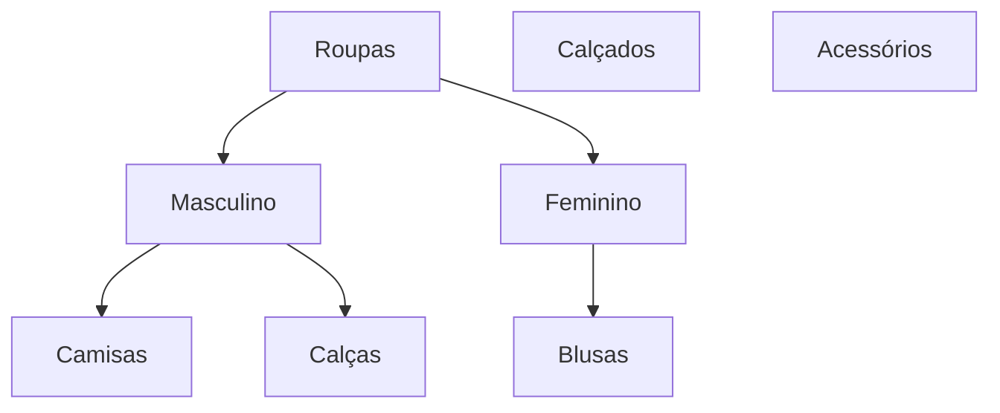

# Plano de Implementação: MegaMenu Dinâmico com Hierarquia de Categorias

---

## 1. Estrutura de Banco de Dados

### Tabela `categories` (após migração)
```sql
CREATE TABLE public.categories (
  id UUID PRIMARY KEY DEFAULT gen_random_uuid(),
  name TEXT NOT NULL,
  slug TEXT NOT NULL UNIQUE,
  image_url TEXT,
  parent_id UUID REFERENCES public.categories(id), -- NOVO
  created_at TIMESTAMPTZ NOT NULL DEFAULT now()
);
```
- `parent_id` permite criar subcategorias ilimitadas.

---

## 2. Admin: Gerenciamento de Categorias

### a) Formulário de Categoria
- Campo para selecionar categoria "pai" (dropdown ou árvore).
- Validação para evitar loops (categoria não pode ser filha dela mesma).

### b) Visualização
- Exibir categorias em árvore (ex: lista indentada, drag-and-drop, ou treeview).
- Permitir adicionar, editar, mover, excluir categorias e subcategorias.

### Exemplo de UI (pseudo-wireframe)
```
Roupas
  ├─ Masculino
  │    ├─ Camisas
  │    └─ Calças
  └─ Feminino
       └─ Blusas
Calçados
Acessórios
```

---

## 3. Cadastro/Edição de Produtos
- Ao cadastrar/editar produto, selecionar a subcategoria correta (dropdown hierárquico).
- Produtos podem ser filtrados por qualquer nível de categoria.

---

## 4. Frontend: MegaMenu Dinâmico

### a) Estrutura de Dados
- Buscar categorias do backend já estruturadas em árvore (ex: via API ou query recursiva).
- Exemplo de estrutura:
```js
[
  {
    id: '1',
    name: 'Roupas',
    children: [
      {
        id: '2',
        name: 'Masculino',
        children: [
          { id: '4', name: 'Camisas', children: [] },
          { id: '5', name: 'Calças', children: [] }
        ]
      },
      {
        id: '3',
        name: 'Feminino',
        children: [
          { id: '6', name: 'Blusas', children: [] }
        ]
      }
    ]
  },
  { id: '7', name: 'Calçados', children: [] },
  { id: '8', name: 'Acessórios', children: [] }
]
```

### b) Componente MegaMenu
- Renderizar menu com múltiplos níveis (hover ou click para abrir submenus).
- Cada submenu pode abrir outro nível.
- Ao clicar em uma subcategoria, filtrar produtos por aquela categoria (e, opcionalmente, suas subcategorias).

---

## 5. Filtro de Produtos
- Atualizar lógica de filtro para aceitar múltiplos níveis de categoria.
- Exemplo: ao clicar em "Camisas", mostrar todos os produtos dessa subcategoria.
- (Opcional) Permitir filtro recursivo: mostrar produtos de uma categoria e todas as suas subcategorias.

---

## 6. Migração Inicial (SQL)
```sql
ALTER TABLE public.categories ADD COLUMN parent_id UUID REFERENCES public.categories(id);
```

---

## 7. Observações Técnicas
- Atualizar queries para buscar categorias em árvore.
- Atualizar policies de RLS se necessário.
- Testar performance com muitas categorias/subcategorias.
- Garantir que a exclusão de uma categoria trate as subcategorias corretamente.

---

## 8. Sugestão de Componentes/Libraries
- MegaMenu: Radix UI, Headless UI, ou custom React.
- TreeView Admin: react-sortable-tree, react-dnd-treeview, ou custom.
- Dropdown hierárquico: react-select com grouped options, ou custom.

---

## 9. Resumo Visual (Mermaid)


---

## 10. Passos para Implementação
1. Migrar banco para incluir `parent_id` em `categories`.
2. Atualizar admin para criar/editar categorias com hierarquia.
3. Atualizar cadastro/edição de produtos para selecionar subcategoria.
4. Criar componente MegaMenu dinâmico no frontend.
5. Atualizar filtro de produtos para aceitar múltiplos níveis.
6. Testar toda a navegação, cadastro e filtro.

---

**Este plano serve como blueprint para a implementação completa do MegaMenu dinâmico e hierarquia de categorias no Xegai Outlet.** 